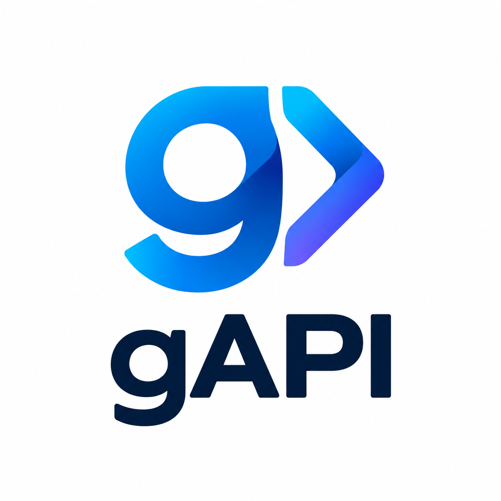



# gAPI

> Experimental full-stack .NET ecosystem focused on strongly typed APIs, source generation, code generation, automatic UI generation, and real-time communication.

gAPI is a collection of .NET libraries, Roslyn source generators, backend/frontend code generators, and infrastructure tools designed to drastically reduce repetitive application plumbing while keeping full control over the generated and runtime layers.

The project is heavily focused on:

* Strongly typed contracts
* Automatic API generation
* Real-time communication
* Generated CRUD flows
* Generated UI components/pages
* Minimal manual glue code
* Keeping full control when needed

The ecosystem is currently used in working projects and is available as a set of public NuGet packages.

---

# Status

⚠️ **Important:** gAPI is currently in **beta** and is **not production-ready**.

The packages are publicly available on NuGet and have been tested as actual package dependencies in existing applications.

The APIs and generated code may still change, including breaking changes.

The project is primarily focused on experimentation, architecture exploration, and building a cohesive .NET developer ecosystem.

---

# Philosophy

A major design goal of gAPI is:

> Generate as much repetitive infrastructure as possible, while still allowing developers to fully take over any layer manually.

Most parts of the ecosystem are intentionally designed as **drop-in systems**:

* You can use the generated/default implementations
* Or replace them with your own implementations
* You can keep generated source code and modify it manually
* You can use only the parts of the ecosystem that are useful to your application

gAPI tries to avoid trapping developers in a rigid framework.

---

# Ecosystem Overview

## gAPI.Core

The shared core library used throughout the ecosystem.

Contains common:

* Attributes
* Delegates
* Interfaces
* DDD-style key/id classes
* Helpers and utilities
* Communication abstractions
* Serialization-related infrastructure

---

## gAPI.Core.Server

The server-side core package.

Provides shared server-side infrastructure used by the gAPI server components, including:

* Base data contexts
* Middleware
* Mapping helpers
* Account services
* Communication helpers
* Server-side infrastructure abstractions

---

## gAPI.Core.Client

The client-side core package.

Provides shared client-side infrastructure, including:

* Item/list datasource helpers
* Standard client views
* Authentication helpers
* `AuthenticatedHttpClient`
* HTTP client handlers
* Client-side communication infrastructure

---

# Roslyn Source Generators

One of the core ideas behind gAPI is using Roslyn Source Generators to eliminate repetitive application plumbing.

The application developer defines strongly typed interfaces and models, while gAPI generates the infrastructure required to connect those contracts to the application.

---

## gAPI.AutoApi.Server

Generates server-side REST and SSE infrastructure for interfaces marked with:

* `GenerateApi`
* `GenerateMinimalApi`
* `GenerateHub`

The generated server infrastructure provides:

* Automatic endpoint generation
* Automatic routing
* Service implementation wiring
* Strongly typed API contracts
* Authentication integration
* Server-to-client communication through SSE

AutoApi uses the normal .NET JSON serialization infrastructure for API payloads.

---

## gAPI.AutoApi.Client

Generates strongly typed client-side REST and SSE proxies.

The communication model is:

* `GenerateApi` → client to server
* `GenerateHub` → server to client

AutoApi uses:

* REST/JSON for client-to-server communication
* SSE/JSON for server-to-client communication

The generated clients expose the API contracts directly to the application, removing the need to manually maintain HTTP request/response plumbing.

AutoApi is intended for conventional HTTP-based applications where REST and SSE are appropriate.

---

## gAPI.AutoWss.Server

Provides the server-side WebSocket infrastructure for strongly typed full-duplex communication.

AutoWss uses the same contract-oriented programming model as AutoApi:

* `GenerateApi` → client to server
* `GenerateHub` → server to client

Because WebSockets are full-duplex, both communication directions can use the same persistent connection.

The server package handles the generated WebSocket API infrastructure, connection management, authentication integration, and communication with generated client Hubs.

---

## gAPI.AutoWss.Client

Provides the client-side WebSocket implementation.

Generated clients can communicate with the server through a persistent WebSocket connection without manually implementing:

* Message routing
* Serialization
* Request/response correlation
* Hub dispatching
* Connection-level communication plumbing

Client-side Hub implementations can register through:

* `IClientConnection`

AutoWss also supports asynchronous streaming using `IAsyncEnumerable<T>` for both requests and responses, including cancellation and backpressure.

---

## gAPI.AutoSerializer

Automatically generates serializers for classes marked with the `GenerateSerializer` attribute.

Can generate:

* Binary serializers
* Span serializers
* Multipart form-data serializers
* Comparers
* Copy/create methods

Supported serialization targets include:

* `BinaryReader` / `BinaryWriter`
* `Span<byte>`
* HTTP multipart content

AutoSerializer is used internally by parts of the gAPI ecosystem where generated high-performance serialization is beneficial.

---

# Authentication

## gAPI.AutoAuth.Client

Provides client-side authentication and session support for gAPI applications.

It integrates with the generated communication clients and provides the client-side authentication infrastructure required by gAPI applications.

---

## gAPI.AutoAuth.Server

Provides server-side authentication and session infrastructure.

Authentication is intentionally kept separate from normal API payload serialization and communication contracts.

AutoApi integrates with the normal ASP.NET Core HTTP authentication model, while AutoWss can associate WebSocket connections with authenticated application sessions.

---

# Automatic UI Generation

## gAPI.AutoComponent

Automatically generates reusable UI components for CRUD-style APIs.

When CRUD methods are marked with special attributes:

* `IsCreate`
* `IsRead`
* `IsUpdate`
* `IsDelete`
* `IsList`

the generator can create components such as:

* Details
* Dropdowns
* Forms
* Editable grids
* Lists
* Selectors
* Tables

The generated components are intended to remove repetitive UI plumbing while remaining customizable.

---

## gAPI.AutoPage

Automatically generates pages from `GenerateApi` interfaces using:

* `IsPage` method attributes

Supports:

* Complex object graphs
* Arrays
* Immutable-style data structures

The goal is to derive application UI from the same strongly typed service model used by the API layer.

---

# Physical Code Generation

Unlike Roslyn source generators, these libraries generate actual source files into the project.

---

## gAPI.CodeGen.Backend

Generates a backend layer based on an Entity Framework `DbContext`.

Can generate:

* DTOs
* CRUD services
* Service interfaces
* State objects
* Mappers
* UseCases

UseCases act as an adapter layer between:

* Entity Framework
* CRUD services

and are intended to centralize:

* Authorization
* Record-level security
* Business access rules

The generated backend can then be used as the service model consumed by the rest of the gAPI ecosystem.

---

## gAPI.CodeGen.Frontend

Generates frontend pages and components physically into the project.

Uses the service model, including `GenerateApi` interfaces, as its source.

Can generate:

* Pages
* CRUD components
* Layout structures

Generated source code can be:

* Kept as-is
* Customized manually
* Replaced with custom implementations
* Combined with the runtime-generated component system

---

# Infrastructure

## gAPI.Storage.Server

A lightweight storage server designed to integrate with the gAPI ecosystem.

It provides storage abstractions with support for:

* Local storage
* Azure Storage
* Custom implementations

The storage system does not require SQL Server and can use `gAPI.EntityFrameworkDisk` for file-based persistence.

It is intended primarily for lightweight and self-hosted scenarios.

---

## gAPI.Fabric.Server

A server-side backplane for routing real-time communication between multiple API instances.

Fabric is primarily relevant when multiple API nodes are running behind a load balancer and server-to-client communication needs to reach clients connected to another API instance.

It can route:

* SSE communication
* WSS communication

The architecture is designed so that normal client-to-server communication does not require Fabric.

Future plans include:

* Service discovery
* Service-to-service communication
* Broader service bus integration

---

## gAPI.EntityFrameworkDisk

An experimental file-based persistence library inspired by classic Entity Framework-style workflows.

Instead of using a traditional SQL database, data is stored directly on disk using generated serializers and indexed storage structures.

Features include:

* High-performance generated serializers
* Key index files for fast lookups
* LINQ expression support for key-index-based queries
* Experimental lazy loading support
* Experimental support for complex DDD-style entities and aggregates

The library is primarily designed for lightweight and self-hosted scenarios and is currently used internally by `gAPI.Storage.Server`.

It is still highly experimental and actively evolving.

---

# Tooling

## gAPI.ConfigTool

A small helper utility intended to simplify project configuration when installing gAPI packages.

It is currently not actively used.

The long-term goal is to reduce configuration complexity and rely more heavily on standard project configuration and environment variables.

---

## gAPI.Tester

A small internal test project.

It compiles.

That's about all the guarantees it currently provides. 😄

Please don't use it as a reference implementation.

For an example of gAPI being used in a real application, see:

- https://github.com/willembeltman/LanCloud
- https://github.com/willembeltman/UwvLlm

Read more about these projects at the end of this readme file.

---

# Communication Models

gAPI currently provides two primary communication models.

## AutoApi

HTTP-based communication using:

* REST
* JSON
* SSE

It is suited to applications where conventional HTTP communication is preferred.

The communication model is:

___
[GenerateApi]
Client ──────────> Server
       REST/JSON

[GenerateHub]
Client <────────── Server
        SSE/JSON
___

---

## AutoWss

Persistent full-duplex communication using WebSockets.

The same strongly typed contract model is used for both directions:

___
[GenerateApi]
Client <──────────> Server

[GenerateHub]
Client <──────────> Server
___

AutoWss is designed for applications that require low-latency bidirectional communication and streaming.

---

# Generated Code

A central principle of gAPI is that generated code should remain understandable and controllable.

Depending on the generator, gAPI can either:

* Generate code at compile time through Roslyn
* Generate physical source files into the project
* Provide runtime infrastructure around generated contracts

The generated code is intended to be ordinary .NET code that can be inspected and, where appropriate, replaced or customized.

---

# Current Weaknesses / TODO

## Generated Components

The generated UI/component system is still incomplete and evolving.

## Documentation

Documentation and examples are still being expanded.

## Breaking Changes

Breaking changes can happen frequently while the architecture is still evolving. See the Issues section of Github for latest state. https://github.com/willembeltman/gAPI/issues

---

# Why Open Source?

The ecosystem has grown large enough to support multiple working applications and experiments.

Open sourcing it allows:

* Transparency
* Collaboration
* Architectural discussion
* Portfolio visibility
* Experimentation with advanced .NET tooling concepts
* Feedback from other .NET developers

The project is intentionally published in an experimental state rather than waiting until every part of the ecosystem is considered finished.

---

# Technologies & Concepts

gAPI heavily experiments with:

* .NET
* C#
* Roslyn Source Generators
* ASP.NET Core
* Minimal APIs
* REST
* SSE
* WebSockets
* Strongly typed API contracts
* Code generation
* Generated serialization
* Immutable-style models
* Automated CRUD/UI generation
* Entity Framework
* File-based persistence
* Full-stack .NET workflows

---

# NuGet

The gAPI ecosystem is available through the following public NuGet packages:

## Core

* `gAPI.Core` https://www.nuget.org/packages/gAPI.Core/
* `gAPI.Core.Client` https://www.nuget.org/packages/gAPI.Core.Client/
* `gAPI.Core.Server` https://www.nuget.org/packages/gAPI.Core.Server/

## AutoApi

* `gAPI.AutoApi.Client` https://www.nuget.org/packages/gAPI.AutoApi.Client/
* `gAPI.AutoApi.Server` https://www.nuget.org/packages/gAPI.AutoApi.Server/

## AutoWss

* `gAPI.AutoWss.Client` https://www.nuget.org/packages/gAPI.AutoWss.Client/
* `gAPI.AutoWss.Server` https://www.nuget.org/packages/gAPI.AutoWss.Server/

## Authentication

* `gAPI.AutoAuth.Client` https://www.nuget.org/packages/gAPI.AutoAuth.Client/
* `gAPI.AutoAuth.Server` https://www.nuget.org/packages/gAPI.AutoAuth.Server/

## Other

* `gAPI.AutoSerializer` https://www.nuget.org/packages/gAPI.AutoSerializer/
* `gAPI.Fabric.Server` https://www.nuget.org/packages/gAPI.Fabric.Server/

---

# Example Project

A working example using gAPI can be found here:

### 🌐 LanCloud

https://github.com/willembeltman/LanCloud

Within LanCloud, `gAPI.AutoWss` and `gAPI.AutoAuth` are utilized as a highly efficient service bus for multiple console clients.

- **What it does**: It acts as a local API storage server for your network. You can connect your local file explorer to it using `FTP` (currently a bit buggy) or `WebDAV`.
- **How it works**: When you launch a `LanCloud Host` console application on machines across your network, they establish a connection to the central API via `gAPI.AutoWss`. The host application then automatically *answers* the API whenever your file explorer triggers a new request, making the host's local storage seamlessly appear as part of the shared network pool.
- **The gAPI advantage**: Thanks to the strict server-to-client contract rules of `gAPI.AutoWss` combined with native support for `IAsyncEnumerable` (enabling 1-to-many streaming across multiple clients), this approach works flawlessly. For example, when executing a `ListDirectories` task, a single method call fetches the folder structures from all connected hosts simultaneously:

```
var allHostDirectories = clientContext.HostHub.ToAll.GetDirectories(path, ct)
```

- Project status: This version is fully functional but currently on pause, as it was built to support a different application that takes priority right now. There are some temporary design choices in place, for example, if multiple hosts hold different versions of the same file in their root directory, the system defaults to picking the newest version. While this might not remain the permanent default behavior, it works perfectly for now.

### 📱 UwvLlm
https://github.com/willembeltman/UwvLlm

This project serves as a fast-paced, 24-hour Proof of Concept (PoC) showcasing gAPI integrated into a .NET MAUI application (native XAML, not Blazor).

- **The challenge**: gAPI was originally engineered with `Blazor WebAssembly` and `Blazor MAUI` targets in mind, meaning standard `XAML-based MAUI apps` are not supported out of the box.
- **The showcase**: This repository acts as an excellent case study on how you can still successfully adopt the core architecture of gAPI and enjoy its main advantages in a standard mobile/desktop framework. While features like `gAPI.CodeGen.Frontend`, `gAPI.AutoComponent`, and `gAPI.AutoPages` cannot be used here, this project still heavily utilizes `gAPI.AutoApi` and `gAPI.CodeGen.Backend`. This architectural split allowed me to let gAPI handle the backend, leaving me to focus entirely on setting up a clean MVVM frontend.
- **Current status**: The project implements `gAPI.AutoApi` and `gAPI.AutoAuth`. While the core data pipeline functions well, the plumbing for real-time `Server-Sent Events` (SSE) callbacks is still being ironed out. The definitive solution is already planned, but time constraints have pushed the upgrade to a later date. If you are an experienced MAUI developer, you will likely spot the exact integration issue immediately, and just to be clear, it is a MAUI quirk, not a gAPI issue!

---

# Repository

The complete source code is available on GitHub:

https://github.com/willembeltman/gAPI

---

# Final Note

gAPI is still evolving rapidly.

Some parts are already stable enough to be used in working applications.
Other parts are experimental and may change substantially.

The main goal is to explore how far strongly typed contracts, source generation, physical code generation, and generated application infrastructure can go in a modern .NET application.

The project is now public, the packages are on NuGet, and the next step is to make the ecosystem easier for other developers to explore and use.